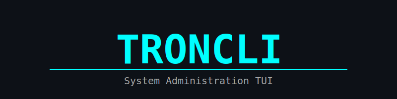

<div align="center">



<table>
<tr>
<td align="left" width="55%">

### TRONCLI | System Administration TUI

<br>

**Production Grade Linux Tool**
Real-time Monitoring | LVM Management | Security Auditing

<br>

_"Building systems that do not wake people up at 3 AM."_

</td>
<td align="center" width="45%">
<h3>TRONCLI<br>INTERFACE</h3>
</td>
</tr>
</table>

</div>

### Status

<div align="center">
  
  
  
  
</div>

<br>

### Core Modules

<div align="center">

<table>
<tr>
<td valign="top" width="50%">

<h3>System Dashboard</h3>


<hr>

<h3>LVM Manager</h3>


</td>

<td valign="top" width="50%">

<h3>Network Matrix</h3>


<hr>

<h3>Security Audit</h3>


</td>
</tr>
</table>

</div>

### Installation

```bash
git clone https://github.com/rsdenck/troncli.git
cd troncli
go build -ldflags="-s -w" -o troncli cmd/troncli/main.go
./troncli
```

### Architecture

The system follows Clean Architecture principles with strict separation of concerns.

```text
cmd/
  troncli/       # Entry Point
internal/
  core/          # Domain Logic & Ports
  modules/       # Implementations (Linux Specific)
  ui/            # TUI Layer (tview/tcell)
```

### Security

Please report vulnerabilities to `ranlens.denck@protonmnail.com`.
See [SECURITY.md](SECURITY.md) for details.
